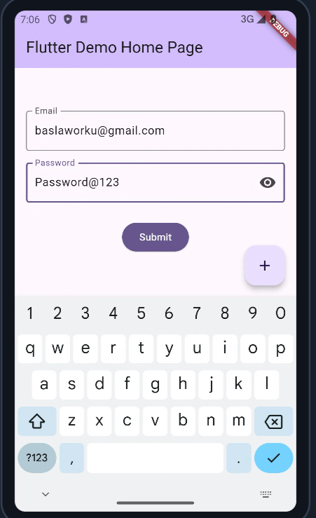

# myapp

A Flutter application demonstrating a simple login form with specific credential validation.

## Overview

This application presents a login screen where users can enter their email and password. 
The application is designed to only allow login with the following credentials:

-   **Email:** baslaworku@gmail.com
-   **Password:** Password@123

Upon successful login with the correct credentials, a "Login successful!" message is displayed. 
Otherwise, an "Invalid credentials" error message is shown.

## Getting Started

To run this project, you will need to have Flutter installed on your machine. Once you have Flutter set up, follow these steps:
1. Clone this repository to your local machine.
2. Navigate to the project directory in your terminal.
3. Run `flutter pub get` to install the necessary dependencies.
4. Run `flutter run` to start the application.
